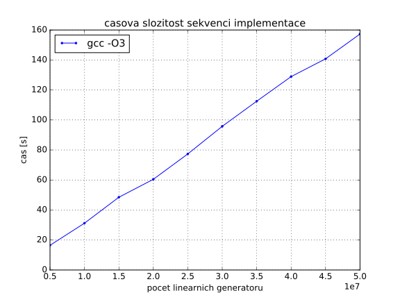
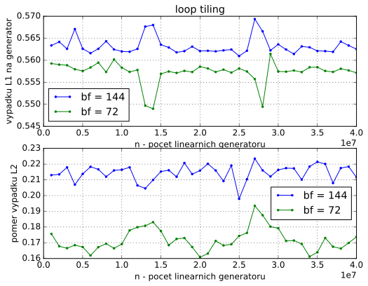
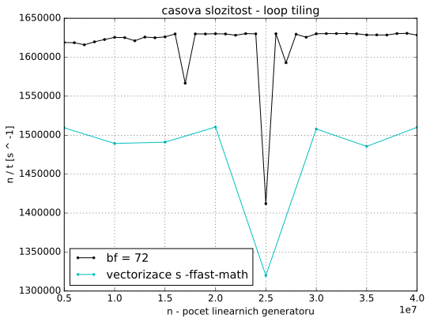

linearni generatory
===================

<podszond@fit.cvut.cz>

- [zdrojovy kod](https://github.com/podondra/linear-generator)
- [sekvenci implementace](src/seq.cc)
- [optimalizovana implementace](src/opt.cc)
- [Makefile](Makefile)

kapitola 1
----------

### definice problemu ###

Mějme několik `G` daných
lineárních generátorů, každý z nich je dán parametry `a`, `b`, `n`. Generátor
vypočítává posloupnost `x[i] = (a * x[i - 1] + b) mod 2 ^ n`, kde `a` a `b`
jsou kladná lichá čísla, `10 < n < 32` a `x[0] = 0`. Počet členů této
posloupnosti je `k` (pro všechny generátory stejné). Úkolem je pro dané
konstanty `c`, `d`, `e` (pro všechny generátory stejné), najít:

1. kolikrát je pro daný generátor `x[i]` v intervalu `[c, d]`
2. kolik je pro daný generátor minimální a maximální Hammingova vzdálenost
    mezi `x[i]` a parametrem `e`

### popis sekvencniho algoritmu a jeho implementace ###

Sekvenci algoritmus se sklada ze dvou `for` cyklu. Vnejsi cyklus iteruje
pres vsechny linearni generatory `G`. `G` jsou ulozeny ve
dvourozmernem poli. V kazdem radku je trojice `uint32_t` cisel `a`, `b` a
`n`.

    /* for each linear generator */
    for (size_t i = 0; i < num; ++i) {
        a = linear_generators[i][0];
        b = linear_generators[i][1];
        n = linear_generators[i][2];
        x = 0;
        count = 0;
        min = UINT32_MAX;
        max = 0;

Vnitrni cyklus pocita a zkouma jednotlive cleny posloupnosti `x[k]`
linearniho generatoru.

        for (size_t j = 0; j < k; ++j) {
            /* compute next value */
            x = lin_gen(a, x, b, n);

            /* check if x is in interval */
            if (is_in_interval(x, c, d))
                ++count;

            /* compute hamming distance */
            dist = hamming_distance(x, e);
            /* check minimal hamming distance */
            if (min > dist)
                min = dist;
            /* check maximal hamming distance */
            if (max < dist)
                max = dist;
        }

        /* use computed values so compiler does not exclude them */
        fprintf(stderr, "%" PRIu32 "%" PRIu32 "%" PRIu32, count, min, max);
    }

#### popis implementovanych funkci ####

1. `lin_gen()` pocita nasledujici clen posloupnosti. Pro umocneni
    `2 ^ n` pouzivam operaci bitovy posun.

        uint32_t lin_gen(uint32_t a, uint32_t x, uint32_t b, uint32_t n) {
            /* don't care about overflow */
            return (a * x + b) % (2 << (n - 1));
        }

2. `is_in_interval()` provede dve porovnani a vrati `true`
    pokud je `x` v zadanem intervalu jinak `false`.

        bool is_in_interval(uint32_t x, uint32_t start, uint32_t end) {
            return start <= x && x <= end;
        }

3. `hamming_distance()` implementuje algoritmus pro ziskani
    Hammingovy vzdalenosti z bitoveho or (`^`) promennych `x` a `e`
    postupnym odebiranim bitu ve `while` cyklu. Tato implementace je datove
    zavisla. Presto budu generovat data nahodne. Po optimalizacich bude
    tato zavislost odstranena.

        uint32_t hamming_distance(uint32_t x, uint32_t y) {
            uint32_t distance = 0;
            uint32_t xor_val = x ^ y;
            while (xor_val) { /* count the number of bits set */
                ++distance; /* a bit is set increment the counter */
                xor_val &= xor_val - 1; /* remove the counted bit */
            }
            return distance;
        }

### kompilace programu ###

Pro kompilaci programu pouzivam kompilator gcc. Zakladni kompilace pouziva
prepinace:

    g++ -std=c++11 -march=ivybridge -O3 ...

`-march=ivybridge` zajisti kompilovani kodu pro vypocetni svazky Intel Xeon
2620 v2 @ 2.1Ghz. Nastaveni jsem zjistil prikazem:

    gcc -march=native -Q --help=target | grep march
      -march=                           ivybridge

### namerene hodnoty casove slozitost ###

kapitola 2 (optimalizovana verze)
---------------------------------

V nasledujici casti popisu optimalizece programu a analyzuji jejich
dopad na vykonost.

### inline funkce a population count ###

Vlozenim kodu funkci v neziskam zadne zrychleni, protoze `-O3`
nastaveni kompilatoru provede _inlining_ automaticky.

Kod pro vypocet Hammingovy vzdalenosti je neefektvni,
netrva konstatni dobu. Efektivnejsi implementace je pomoci _population count_:

    dist = x ^ e;
    dist = dist - ((dist >> 1) & 0x55555555);
    dist = (dist & 0x33333333) + ((dist >> 2) & 0x33333333);
    dist = (((dist + (dist >> 4)) & 0x0F0F0F0F) * 0x01010101) >> 24;

Tento algoritmus vypocita Hammingovu vzdalenost 32 bitoveho integeru
(`uint32_t`) v konstantnim case. Program se zrychli v prumeru ctryrikrat.

### loop intechange ###

Program nevyuziva vektorovych instrukci. Podporu tech instrukci
pri kompilaci zapneme prepinacem `-mavx`.

V generovani vektorovych instrukci brani kompilatoru datova zavislost `x` na
predchozi iteraci:

    x = ((a * x + b) % (2 << (n - 1)));

Transformace _loop interchange_ odstrani tuto zavislost. Vnejsi cyklus bude
iterovat pres cleny posloupnosti `x[i]` a vnitri cyklus pres vsechny
linearni generatory.

Vysledny kod viz nize. Parametry linernich generatoru ukladam v
jednorozmernych polich.

    for (size_t i = 0; i < k; ++i) {
        /* for each linear generator */
        for (size_t j = 0; j < num; ++j) {
            /* compute next value */
            x[j] = ((a[j] * x[j] + b[j]) % (2 << (n[j] - 1)));

            /* check if x is in interval */
            if (c <= x[j] && x[j] <= d)
                count[j] += 1;

            /* compute hamming distance */
            dist = x[j] ^ e;
            dist = dist - ((dist >> 1) & 0x55555555);
            dist = (dist & 0x33333333) + ((dist >> 2) & 0x33333333);
            dist = (((dist + (dist >> 4)) & 0x0F0F0F0F) * 0x01010101) >> 24;

            /* check minimal hamming distance */
            if (min[j] > dist)
                min[j] = dist;
            /* check maximal hamming distance */
            if (max[j] < dist)
                max[j] = dist;
        }
    }

### branch-less code ###

Kompilator ani tento kod nedokaze vektorizovat. Vypis prepinace
`-fopt-info-vec-all` gcc:

    not vectorized: control flow in loop.

`if` podminky brani vektorizaci. Misto nich pouziji ternarni neboli min a
max operatory.

    count[j] += (c <= x[j] && x[j] <= d) ? 1 : 0;
    min[j] = (min[j] < dist) ? min[j] : dist;
    max[j] = (max[j] > dist) ? max[j] : dist;

### aliasing ###

Nyni kompilator hlasi problem s _aliasingem_:

    number of versioning for alias run-time tests exceeds 10

Muj program pristupuje ke kazdemu poli prave jednim ukazatelem. _Aliasing_
vyloucim pridanim klicoveho slova `__restrict__` k pointerum. Pro
snadnejsi implementaci vytvorim pro vypocet vlastni funkci `opt_computation()`
s nasledujici definici:

    void opt_computation(
            uint32_t num,
            uint32_t k,
            uint32_t c,
            uint32_t d,
            uint32_t e,
            uint32_t *__restrict__ a,
            uint32_t *__restrict__ b,
            uint32_t *__restrict__ n,
            uint32_t *__restrict__ x,
            uint32_t *__restrict__ min,
            uint32_t *__restrict__ max,
            uint32_t *__restrict__ count
            );

### loop fission ###

Kompilator stale nemuze program vektorizovat kvuli nepodporovane operaci.

    not vectorized: relevant stmt not supported: _30 = 2 << _29;

V kodu se zbytecne dokola pocita hodnota `2 ^ n`, ktera se v prubehu vypoctu
nemeni. Pomoci transformace _loop fision_ ji vypocitam pred hlavnimi
`for` cykly.

    for (size_t j = 0; j < num; ++j)
        n[j] = 2 << (n[j] - 1);

    for (size_t i = 0; i < k; ++i) {
        for (size_t j = 0; j < num; ++j) {
            x[j] = (a[j] * x[j] + b[j]) % n[j];

### vektorizace ###

AVX nepodporuje ani modulo operator:

    not vectorized: relevant stmt not supported: _40 = _37 % _39;

Modulo nahradim nasobenim inverzi cisla. Pole `n` prevest z datoveho typu
`uint32_t` na `float` a upravim provadene operace.

    for (size_t j = 0; j < num; ++j)
        n[j] = 1.f / std::exp2(n[j]);

    for (size_t i = 0; i < k; ++i) {
        for (size_t j = 0; j < num; ++j) {
            x[j] = a[j] * x[j] + b[j];
            x[j] -= ((uint32_t)(x[j] * n[j])) * n[j];

Konecne kompilator vnitrni cyklus vektorizuje:

    loop vectorized

Podle kompilatoru je velikost pouziteho vektoru 4. Take v asembleru jsou
pouzity xmm registry a ne ymm registry. To znamena, ze jedna operace se
provadi se ctyrmi 32 bitovymi integery (dohromady 128 bitu). AVX ma registy
256 bitove, ale pro integerove operace podporuje pouze 128 bitove operace.

Vektorizovany program je nejvykonnejsi ze vsech, prestoze se zvysil pocet
operaci ve zdrojovem kodu.

### memory alignment a `-ffast-math` ###

Dale optimalizuji zarovnani poli v pameti. Kompilator vedle hlasky o
vektorizaci zobrazuje:

    loop peeled for vectorization to enhance alignment

Pole alokuji 32 bajtove zarovnane podle doporuceni v
[Introduction to Intel AVX](https://software.intel.com/en-us/articles/introduction-to-intel-advanced-vector-extensions).
Pouziji funkci `aligned_alloc()` a kompilatoru predam tuto informaci funkci
`__builtin_assume_aligned()`. Vzorovy kod pro alokaci pole a:

    *a = (uint32_t *)aligned_alloc(32, num * sizeof(uint32_t));

Ve funkci `opt_computation()`:

    a = (uint32_t *)__builtin_assume_aligned(a, 32);

Program provadi nektere operace s cisli v plovouci radove carce. Operace s nimi
muzu zrychlit prepinacem `-ffast-math`.

### tripruchodova optimalizace ###

GCC podporuje moznost vygenerovani profilovacich dat a jejich pouziti pro
optimalizaci generovani kodu.

Profilovaci data jsem vygeneroval prepinacem `-fprofile-generate` na
50000000 linearnich generatorech. Program kompilovany s `-fprofile-use`
(data se pouziji pri kompilaci) bohuzel zhorsi rychlost vypoctu.

### cache ###

Pro mereni vypadku cache pouziji knihovnu PAPI. Pomoci PAPI mohu na cilove
architekture merit datove vypadky L1 cache (`PAPI_L1_DCM`), datove vypadky
a pristupy L2 cache (`PAPI_L2_DCM` a `PAPI_L2_DCA` resp.).

    #ifdef PAPI
    #include <papi.h>
    #define NUM_EVENTS 3
    #endif

    ...

    #ifdef PAPI
        int Events[NUM_EVENTS] = { PAPI_L1_DCM, PAPI_L2_DCM, PAPI_L2_DCA };
        long_long values[NUM_EVENTS];

        /* start counting events */
        if (PAPI_start_counters(Events, NUM_EVENTS) != PAPI_OK)
            return 0;
    #endif

        opt_computation(num, k, c, d, e, a, b, n, x, min, max, count);

    #ifdef PAPI
        /* Stop counting events */
        if (PAPI_stop_counters(values, NUM_EVENTS) != PAPI_OK)
            return 0;

        fprintf(stdout, "%lld ", values[0]);
        fprintf(stdout, "%lld ", values[1]);
        fprintf(stdout, "%lld ", values[2]);
    #endif

Pri kompilaci je treba pouzit prepinace:

- `-L/usr/lib64`
- `-lpapi`
- `-DPAPI`
- `-I/usr/include`

Takto upraveny program dosahuje vyuziti cache na grafu dole.

### loop tiling ###

V idealnim pripade je potreba optimalizovat program tak, aby do L1 cache
nahraval spravne mnozstvi linearnich generatoru a s nimi provedl
k iteraci bez L1 vypadku.

Technikou _loop tiling_ muzu tohoto castecne dosahnout.

    /* loop tiling - main */
    for (size_t j1 = 0; j1 < num - BF; j1 += BF) {
        for (size_t i = 0; i < k; ++i) {
            for (size_t j = 0; j < BF; ++j) {
                ...
            }
        }
        a += BF;
        b += BF;
        x += BF;
        n += BF;
        min += BF;
        max += BF;
        count += BF;
    }

    /* loop tiling - the rest */
    for (size_t i = 0; i < k; ++i) {
        for (size_t j = 0; j < num % BF; ++j) {
            ...
        }
    }

Do L1 cache pameti by mel program nahrat `BF` linearnich generatoru. S nimi
provest vypocty a na konci dopocitat zbytek ktery se tak do L1 cache
pameti vejde.

Pouziti pointerove aritmetiky zaruci, ze vnitrni cykly mohou iterovat od 0.
To umozni _auto-vektorizaci_ obou nejvnitrnijsich cyklu.

Problem je urcit hodnotu `BF`. Nepodarilo se mi zjistit velikost cache pameti
nasi architekturi. Predpokladam velikost 512 radek a stupen asociativity
2 (jak je uvedeno v prednasce). Muj program pouzivar 7 poli, ktere bude cist po
blocich. To znamena ze muze nahrat `512 * 2 = 1024` bloku. `1024 / 7 =
146.2857` je kandidat pro `BF`. Hodnota snizim na 144, aby byla delitelna 4
(vyhodne pro vektorizaci).

Merenim se ukazalo ze nejvyhodnejsi je `BF = 72` (`#define BF 72` v kodu):

Spravne vyuziti cache pameti opravdu program zrychli.

### loop unrolling ###

Pri technice _loop unrolling_ s faktorem rozbaleni 2 kompilator hlasi:  

    not vectorized: complicated access pattern.

Bez vektorizace by byl program neefektivni, a proto je tuto techniku nevhodne
pouzit.
