lineární generátory
===================

<podszond@fit.cvut.cz>

- [zdrojový kód](https://github.com/podondra/linear-generator)
- [sekvenci implementace](src/seq.cc)
- [optimalizovaná implementace](src/opt.cc)
- [Makefile](Makefile)

kapitola 1
----------

### definice problému ###

Mějme několik `G` daných
lineárních generátorů, každý z nich je dán parametry `a`, `b`, `n`. Generátor
vypočítává posloupnost `x[i] = (a * x[i - 1] + b) mod 2 ^ n`, kde `a` a `b`
jsou kladná lichá čísla, `10 < n < 32` a `x[0] = 0`. Počet členů této
posloupnosti je `k` (pro všechny generátory stejné). Úkolem je pro dané
konstanty `c`, `d`, `e` (pro všechny generátory stejné), najít:

1. kolikrát je pro daný generátor `x[i]` v intervalu `[c, d]`
2. kolik je pro daný generátor minimální a maximální Hammingova vzdálenost
    mezi `x[i]` a parametrem `e`

### popis sekvenčního algoritmu a jeho implementace ###

Sekvenční algoritmus se skládá že dvou `for` cyklů. Vnější cyklus iteruje
přes všechny lineární generátory `G`. `G` jsou uloženy ve
dvourozměrném poli. V každém řádku je trojice `uint32_t` čísel `a`, `b` a
`n`.

    /* for each linear generator */
    for (size_t i = 0; i < num; ++i) {
        a = linear_generators[i][0];
        b = linear_generators[i][1];
        n = linear_generators[i][2];
        x = 0;
        count = 0;
        min = UINT32_MAX;
        max = 0;

Vnitřní cyklus počítá a zkoumá jednotlivé členy posloupnosti `x[k]`
lineárního generátoru.

        for (size_t j = 0; j < k; ++j) {
            /* compute next value */
            x = lin_gen(a, x, b, n);

            /* check if x is in interval */
            if (is_in_interval(x, c, d))
                ++count;

            /* compute hamming distance */
            dist = hamming_distance(x, e);
            /* check minimal hamming distance */
            if (min > dist)
                min = dist;
            /* check maximal hamming distance */
            if (max < dist)
                max = dist;
        }

        /* use computed values so compiler does not exclude them */
        fprintf(stderr, "%" PRIu32 "%" PRIu32 "%" PRIu32, count, min, max);
    }

#### popis implementovaných funkcí ####

1. `lin_gen()` počítá následující člen posloupnosti. Pro umocnění
    `2 ^ n` používám operaci bitový posun.

        uint32_t lin_gen(uint32_t a, uint32_t x, uint32_t b, uint32_t n) {
            /* don't care about overflow */
            return (a * x + b) % (2 << (n - 1));
        }

2. `is_in_interval()` provede dvě porovnání a vrátí `true`
    pokud je `x` v zadaném intervalu jinak `false`.

        bool is_in_interval(uint32_t x, uint32_t start, uint32_t end) {
            return start <= x && x <= end;
        }

3. `hamming_distance()` implementuje algoritmus pro získání
    Hammingovy vzdálenosti z bitového or (`^`) proměnných `x` a `e`
    postupným odebíráním bitů ve `while` cyklu. Tato implementace je datově
    závislá. Přesto budu generovat data náhodně. Po optimalizacích bude
    tato závislost odstraněna.

        uint32_t hamming_distance(uint32_t x, uint32_t y) {
            uint32_t distance = 0;
            uint32_t xor_val = x ^ y;
            while (xor_val) { /* count the number of bits set */
                ++distance; /* a bit is set increment the counter */
                xor_val &= xor_val - 1; /* remove the counted bit */
            }
            return distance;
        }

### kompilace programu ###

Pro kompilaci programu používám kompilátor GCC. Základní kompilace používá
přepínače:

    g++ -std=c++11 -march=ivybridge -O3 ...

`-march=ivybridge` zajistí kompilování kódu pro výpočetní svazky Intel Xeon
2620 v2 @ 2.1Ghz. Nastavení jsem zjistil příkazem:

    gcc -march=native -Q --help=target | grep march
      -march=                           ivybridge

### naměřené hodnoty časově složitost ###

Doba výpočtu záleží na `k` a počtu linearních generátorů. Při zvětšování `k`
nedochází k zvyšování potřebné paměti. Tedy není ovlivněno využití cache
paměti. Naopak zvyšování počtu lineárních generátorů má vliv na cache paměti.
Měřím s konstatním `k = 100` a měnícím se počtem lineárních generátorů `n`.

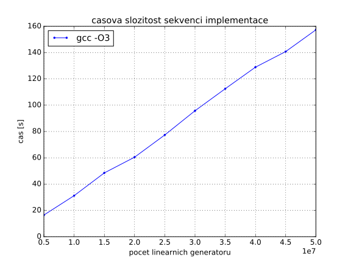

kapitola 2 (optimalizovaná verze)
---------------------------------

V následující části popíšu optimalizace programu a analyzuji jejich
dopad na výkonost.

### inline funkce a population count ###

Vložením kódu funkcí nezískám žádné zrychlení, protože `-O3`
nastavení kompilátorů provede _inlining_ automaticky.

Kód pro výpočet Hammingovy vzdálenosti je neefektvní,
netrvá konstatní dobu. Efektivnější implementace je pomoci _population count_:

    dist = x ^ e;
    dist = dist - ((dist >> 1) & 0x55555555);
    dist = (dist & 0x33333333) + ((dist >> 2) & 0x33333333);
    dist = (((dist + (dist >> 4)) & 0x0F0F0F0F) * 0x01010101) >> 24;

Tento algoritmus vypočítá Hammingovu vzdálenost 32 bitového integeru
(`uint32_t`) v konstantním čase. Program se zrychlí v průměru čtryřikrát.

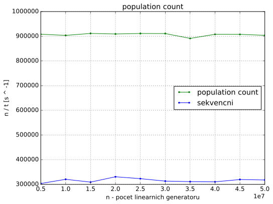

### loop interchange ###

Program nevyužívá vektorových instrukcí. Podporu těch instrukcí
při kompilaci zapneme přepínačem `-mavx`.

V generování vektorových instrukcí brání kompilátorů datová závislost `x` na
předchozí iteraci:

    x = ((a * x + b) % (2 << (n - 1)));

Transformace _loop interchange_ odstraní tuto závislost. Vnější cyklus bude
iterovat přes členy posloupnosti `x[i]` a vnitřní cyklus přes všechny
lineární generátory.

Výsledný kód viz níže. Parametry linernich generátorů ukládám v
jednorozměrných polích.

    for (size_t i = 0; i < k; ++i) {
        /* for each linear generator */
        for (size_t j = 0; j < num; ++j) {
            /* compute next value */
            x[j] = ((a[j] * x[j] + b[j]) % (2 << (n[j] - 1)));

            /* check if x is in interval */
            if (c <= x[j] && x[j] <= d)
                count[j] += 1;

            /* compute hamming distance */
            dist = x[j] ^ e;
            dist = dist - ((dist >> 1) & 0x55555555);
            dist = (dist & 0x33333333) + ((dist >> 2) & 0x33333333);
            dist = (((dist + (dist >> 4)) & 0x0F0F0F0F) * 0x01010101) >> 24;

            /* check minimal hamming distance */
            if (min[j] > dist)
                min[j] = dist;
            /* check maximal hamming distance */
            if (max[j] < dist)
                max[j] = dist;
        }
    }

Bohužel se zvýší paměťová náročnost programu a tento kód není vektorizovaný.
Přesto _loop interchange_ pro některé instance problému výpočet zrychlí.

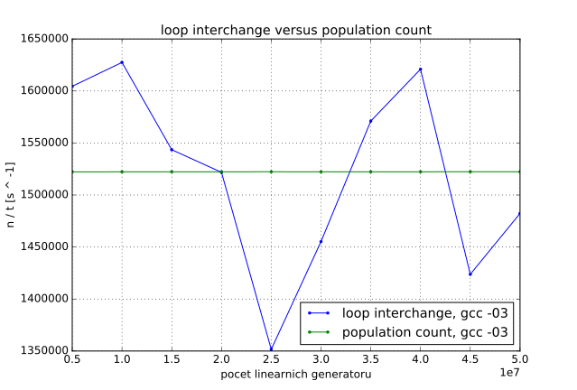

### branch-less code ###

Výpis přepínače `-fopt-info-vec-all` GCC:

    not vectorized: control flow in loop.

`if` podmínky brání vektorizaci. Místo nich použiji ternární neboli `min` a
`max` operátory.

    count[j] += (c <= x[j] && x[j] <= d) ? 1 : 0;
    min[j] = (min[j] < dist) ? min[j] : dist;
    max[j] = (max[j] > dist) ? max[j] : dist;

### aliasing ###

Nyní kompilátor hlásí problém s _aliasingem_:

    number of versioning for alias run-time tests exceeds 10

Můj program přistupuje ke každému poli právě jedním ukazatelem. _Aliasing_
vyloučím přidáním klíčového slova `__restrict__` k pointerům. Pro
snadnější implementaci vytvořím pro výpočet vlastní funkci `opt_computation()`
s následující definici:

    void opt_computation(
            uint32_t num,
            uint32_t k,
            uint32_t c,
            uint32_t d,
            uint32_t e,
            uint32_t *__restrict__ a,
            uint32_t *__restrict__ b,
            uint32_t *__restrict__ n,
            uint32_t *__restrict__ x,
            uint32_t *__restrict__ min,
            uint32_t *__restrict__ max,
            uint32_t *__restrict__ count
            );

### loop fission ###

Kompilátor stále nemůže program vektorizovat kvůli nepodporované operaci.

    not vectorized: relevant stmt not supported: _30 = 2 << _29;

V kódu se zbytečně dokola počítá hodnota `2 ^ n`, která se v průběhu výpočtu
nemění. Pomoci transformace _loop fision_ ji vypočítám před hlavními
`for` cykly.

    for (size_t j = 0; j < num; ++j)
        n[j] = 2 << (n[j] - 1);

    for (size_t i = 0; i < k; ++i) {
        for (size_t j = 0; j < num; ++j) {
            x[j] = (a[j] * x[j] + b[j]) % n[j];

Tato technika zhorší výkonnost. Zřejmu kvůli většímu počtu přístupů do paměti.

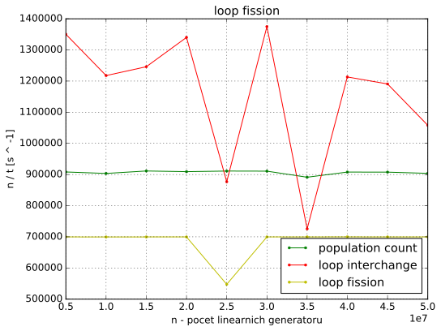

### vektorizace ###

AVX nepodporuje ani modulo operátor:

    not vectorized: relevant stmt not supported: _40 = _37 % _39;

Modulo nahradím násobením inverzí čísla. Pole `n` převedu z datového typu
`uint32_t` na `float` a upravím prováděné operace.

    for (size_t j = 0; j < num; ++j)
        n[j] = 1.f / std::exp2(n[j]);

    for (size_t i = 0; i < k; ++i) {
        for (size_t j = 0; j < num; ++j) {
            x[j] = a[j] * x[j] + b[j];
            x[j] -= ((uint32_t)(x[j] * n[j])) * n[j];

Konečné kompilátor vnitřní cyklus vektorizuje:

    loop vectorized

Podle kompilátorů je velikost použitého vektoru 4. Také v asembleru jsou
použity `xmm` registry a ne `ymm` registry. To znamená, že jedna operace se
provádí se čtyřmi 32 bitovými integery (dohromady 128 bitů a proto pracuji s 32
bitovým integerem). AVX má registry
256 bitové, ale pro celočíselné operace podporuje pouze 128 bitové operace.

Vektorizovaný program je nejvýkonnější že všech, přestože se zvýšil počet
operací ve zdrojovém kódu.

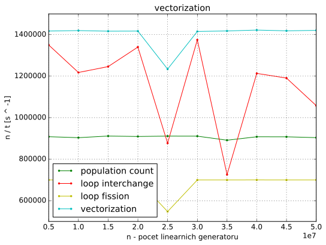

### memory alignment a `-ffast-math` ###

Dále optimalizuji zarovnání polí v paměti. Kompilátor vedle hlášky o
vektorizaci zobrazuje:

    loop peeled for vectorization to enhance alignment

Pole alokuji 32 bajtově zarovnané podle doporučení v
[Introduction to Intel AVX](https://software.intel.com/en-us/articles/introduction-to-intel-advanced-vector-extensions).
Použiji funkci `aligned_alloc()` a kompilátoru předám tuto informaci funkcí
`__builtin_assume_aligned()`. Vzorový kód pro alokaci pole a:

    *a = (uint32_t *)aligned_alloc(32, num * sizeof(uint32_t));

Ve funkci `opt_computation()`:

    a = (uint32_t *)__builtin_assume_aligned(a, 32);

Program provádí některé operace s čísli v plovoucí řádově čárce. Operace s nimi
mužů zrychlit přepínačem `-ffast-math`.

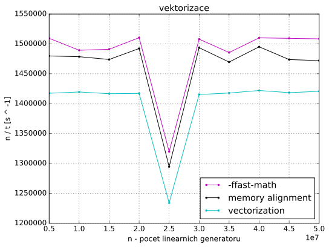

### tříprůchodová optimalizace ###

GCC podporuje možnost vygenerovaní profilovacích dat a jejich použití pro
optimalizaci generování kódu.

Profilovací data jsem vygeneroval přepínačem `-fprofile-generate` na
50000000 lineárních generátorech. Program kompilovány s `-fprofile-use`
(data se použijí při kompilaci) bohužel zhorší rychlost výpočtu.

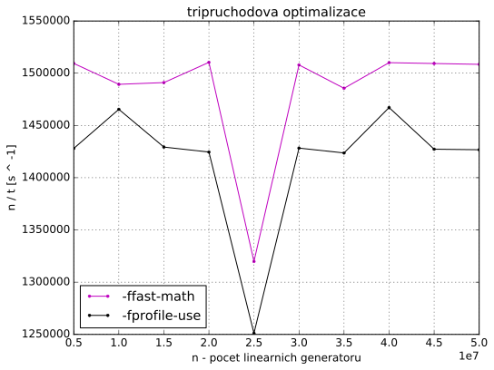

### cache ###

Pro měření výpadku cache použiji knihovnu PAPI. Pomoci PAPI mohu na cílové
architektuře měřit datové výpadky L1 cache (`PAPI_L1_DCM`), datové výpadky
a přístupy L2 cache (`PAPI_L2_DCM` a `PAPI_L2_DCA` resp.).

    #ifdef PAPI
    #include <papi.h>
    #define NUM_EVENTS 3
    #endif

    ...

    #ifdef PAPI
        int Events[NUM_EVENTS] = { PAPI_L1_DCM, PAPI_L2_DCM, PAPI_L2_DCA };
        long_long values[NUM_EVENTS];

        /* start counting events */
        if (PAPI_start_counters(Events, NUM_EVENTS) != PAPI_OK)
            return 0;
    #endif

        opt_computation(num, k, c, d, e, a, b, n, x, min, max, count);

    #ifdef PAPI
        /* Stop counting events */
        if (PAPI_stop_counters(values, NUM_EVENTS) != PAPI_OK)
            return 0;

        fprintf(stdout, "%lld ", values[0]);
        fprintf(stdout, "%lld ", values[1]);
        fprintf(stdout, "%lld ", values[2]);
    #endif

Při kompilaci je třeba použít přepínače:

- `-L/usr/lib64`
- `-lpapi`
- `-DPAPI`
- `-I/usr/include`

Takto upravený program dosahuje využití cache na grafu dole.

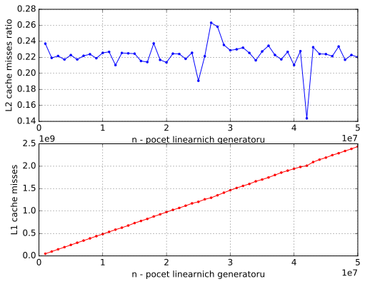

### loop tiling ###

V ideálním případě je potřeba optimalizovat program tak, aby do L1 cache
nahrával správné množství lineárních generátorů a s nimi provedl
`k` iterací bez L1 výpadku.

Technikou _loop tiling_ mužů tohoto částečně dosáhnout.

    /* loop tiling - main */
    for (size_t j1 = 0; j1 < num - BF; j1 += BF) {
        for (size_t i = 0; i < k; ++i) {
            for (size_t j = 0; j < BF; ++j) {
                ...
            }
        }
        a += BF;
        b += BF;
        x += BF;
        n += BF;
        min += BF;
        max += BF;
        count += BF;
    }

    /* loop tiling - the rest */
    for (size_t i = 0; i < k; ++i) {
        for (size_t j = 0; j < num % BF; ++j) {
            ...
        }
    }

Do L1 cache paměti by měl program nahrávat správný počet lineárních generátorů.
S nimi provést výpočty a na konci dopočítat zbytek který se také do L1 cache
paměti vejde.

Použití pointerove aritmetiky zaručí, že vnitřní cykly mohou iterovat od 0.
To umožní _auto-vektorizaci_ obou nejvnitřnějších cyklu.

Problém je určit hodnotu `BF`. Nepodařilo se mi zjistit velikost cache paměti
naší architekturi. Předpokládám velikost 512 řádek a stupeň asociativity
2 (jak je uvedeno v přednášce). Můj program použivá 7 polí, které bude číst po
blocích. To znamená že může nahrát `512 * 2 = 1024` bloku. `1024 / 7 =
146.2857` je kandidát pro `BF`. Hodnota snížím na 144, aby byla dělitelná 4
(výhodné pro vektorizaci).

Měřením se ukázalo že nejvýhodnější je `BF = 72` (`#define BF 72` v kódu):

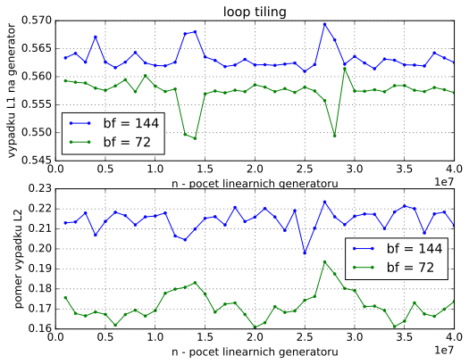

Správné využití cache paměti opravdu program zrychlí.

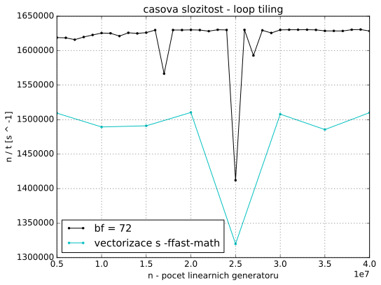

### loop unrolling ###

Při technice _loop unrolling_ s faktorem rozbalení 2 kompilátor hlásí:

    not vectorized: complicated access pattern.

Bez vektorizace by byl program neefektivní, a proto tuto techniku nepoužiji.

### `&` operator ###

Operaci modulo jsem dříve nahradil operacemi násobení inverzí a dolní celá
část. Číslo použivané pro modulení je \\(2 ^ n\\). V binární podobě je to
číslice 1 následované určitým počtem číslic 0. Pokud od čísla odečtu jedna bude
toto číslo v binarní podobě reprezentováno samými číslicemi 1. Můžu tedy použít
operaci logické `&`. Spodní bity v čísle po této logické operaci odpovídají
modulu. 

\\[ 2^{10} = 1024 = 10000000000\_2 \\]

\\[ 2^{10} - 1 = 1111111111\_2 \\]

\\[ 1234 = 10011010010\_2 \\]

\\[ 1234 - 2^{10} = 210\_{10} = 11010010\_2 \\]

\\[ 10011010010\_2 \wedge 1111111111\_2 = 11010010\_2 = 210\_{10} \\]

Hodnoty \\(2^n - 1\\) můžu předpočítat a v hlavním cyklu pouze indexovat
do pole a provádět operaci `&`.

    for (size_t j = 0; j < num; ++j)
        n[j] = (1 << n[j]) - 1;

    ...

    for (size_t j1 = 0; j1 < num - BF; j1 += BF) {
        for (size_t i = 0; i < k; ++i) {
            for (size_t j = 0; j < BF; ++j) {
                x[j] = (a[j] * x[j] + b[j]) & n[j];

S touto úpravou v některých případech dosáhnu až 3,7 násobného zrychlení.

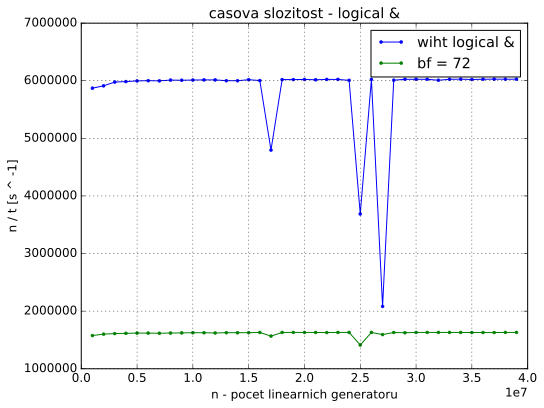

### pole modulů ###

Pole `n` bude obsahovat celkem 21 opakujících se hodnot.
Deklaruji ho staticky:

    uint32_t modules[] = {
            0x0, 0x1, 0x3, 0x7, 0xf, 0x1F, 0x3F, 0x7F, 0xFF, 0x1FF, 0x3FF,
            0x7FF, 0xFFF, 0x1FFF, 0x3FFF, 0x7FFF, 0xFFFF, 0x1FFFF, 0x3FFFF,
            0x7FFFF, 0xFFFFF, 0x1FFFFF, 0x3FFFFF, 0x7FFFFF, 0xFFFFFF,
            0x1FFFFFF, 0x3FFFFFF, 0x7FFFFFF, 0xFFFFFFF, 0x1FFFFFFF,
            0x3FFFFFFF, 0x7FFFFFFF
    };

    ...

    x[j] = (a[j] * x[j] + b[j]) & modules[n[j]];

Kompilár kód nedokáže vektorizovat, a proto statické pole nepoužiji.

    not vectorized: not suitable for gather load _99 = modules[_98];
    bad data references.

### cache parametry ###

Pro lepsi vyuziti cache jsem naspal tento program:

    #include <stdio.h>
    #include <unistd.h>

    int main() {
        printf("_SC_PAGESIZE\t%ld\n", sysconf(_SC_PAGESIZE));
        printf("_SC_LEVEL1_DCACHE_SIZE\t%ld\n", sysconf(_SC_LEVEL1_DCACHE_SIZE));
        printf("_SC_LEVEL1_DCACHE_ASSOC\t%ld\n", sysconf(_SC_LEVEL1_DCACHE_ASSOC));
        printf("_SC_LEVEL1_DCACHE_LINESIZE\t%ld\n", sysconf(_SC_LEVEL1_DCACHE_LINESIZE));
        printf("_SC_LEVEL2_CACHE_SIZE\t%ld\n", sysconf(_SC_LEVEL2_CACHE_SIZE));
        printf("_SC_LEVEL2_CACHE_ASSOC\t%ld\n", sysconf(_SC_LEVEL2_CACHE_ASSOC));
        printf("_SC_LEVEL2_CACHE_LINESIZE\t%ld\n", sysconf(_SC_LEVEL2_CACHE_LINESIZE));
        printf("_SC_LEVEL3_CACHE_SIZE\t%ld\n", sysconf(_SC_LEVEL3_CACHE_SIZE));
        printf("_SC_LEVEL3_CACHE_ASSOC\t%ld\n", sysconf(_SC_LEVEL3_CACHE_ASSOC));
        printf("_SC_LEVEL3_CACHE_LINESIZE\t%ld\n", sysconf(_SC_LEVEL3_CACHE_LINESIZE));
        return 0;
    }

Vystupem je velikost stranky a vlastnisti L1, L2 a L3 cache pameti.
A to velikost v bytech, associativita a velikost radky:

    _SC_PAGESIZE	4096
    _SC_LEVEL1_DCACHE_SIZE	32768
    _SC_LEVEL1_DCACHE_ASSOC	8
    _SC_LEVEL1_DCACHE_LINESIZE	64
    _SC_LEVEL2_CACHE_SIZE	262144
    _SC_LEVEL2_CACHE_ASSOC	8
    _SC_LEVEL2_CACHE_LINESIZE	64
    _SC_LEVEL3_CACHE_SIZE	15728640
    _SC_LEVEL3_CACHE_ASSOC	20
    _SC_LEVEL3_CACHE_LINESIZE	64

Mikroarchitektura nasich procesoru je Ivy Bridge. L1 a L2 cache pameti jsou
tedy u kazdeho jadra a L3 pamet je sdilena.

Velikost L1 pameti je 32768 B a velikost radky je 64 B. Z toho plyne pocet
radku:

\\[32768 / 64 = 512 radek\\]

Program pouziva 7 poli.

\\[512 / 7 = 73\\]

73 radek z kazdeho pole. A kazda radka cache obsahuje:

\\[64 / 4 = 16 \\]

`int32_t` cisel. To znamena hodnota BF:

\\[73 * 16 = 1168\\]
